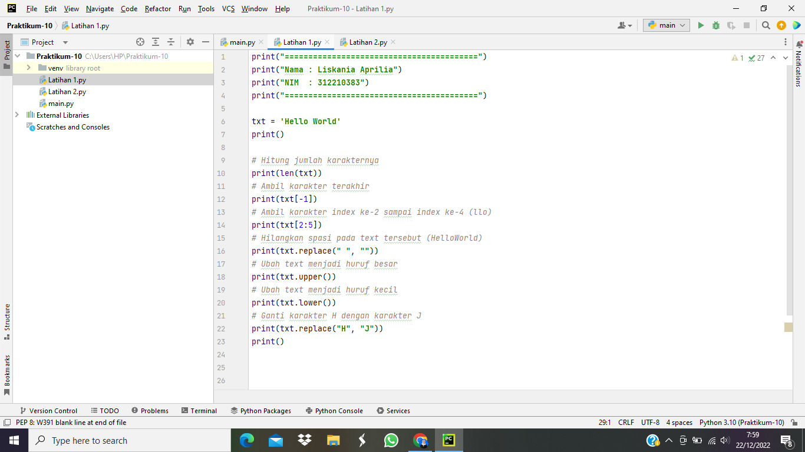
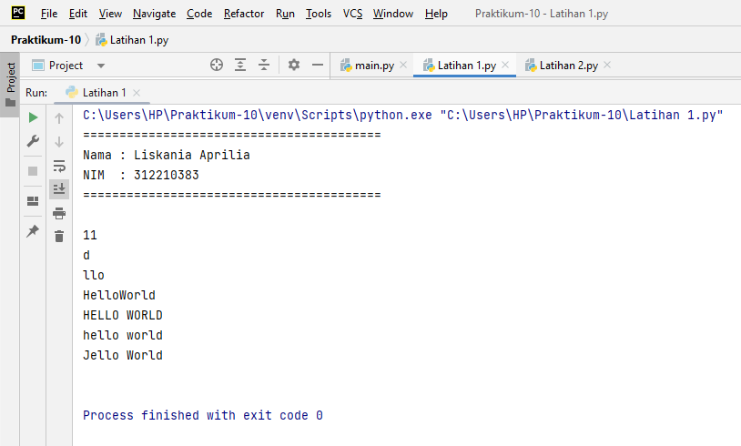
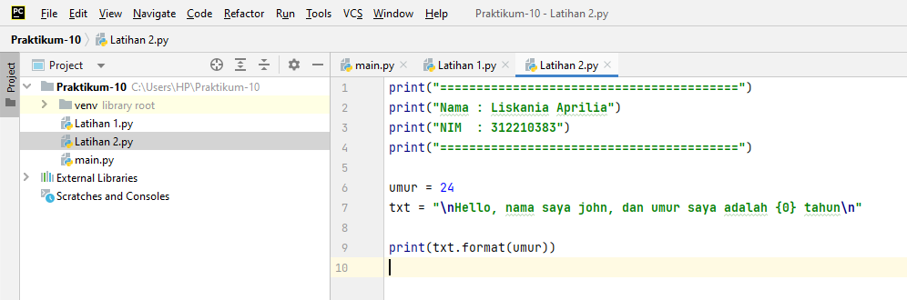
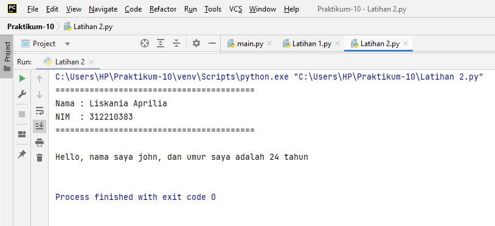

# Praktikum-10

# Latihan 1

1. Python String
- String adalah jenis yang paling populer di Python.
- Untuk membuatnya hanya dengan melampirkan karakter dalam tanda kutip.
- Python memperlakukan tanda kutip tunggal (' ') sama dengan tanda kutip ganda (" ").
- Membuat string semudah memberi nilai pada sebuah variabel.


# Penjelasan Latihan 1

1. Untuk menghitung jumlah karakter, gunakan fungsi len().
``` python
# Menghitung jumlah karakternya
print(len(txt))
``` 
2. Cara mengambil satu karakter pada string yaitu dengan menggunakan kurung siku [ ] dan deklarasi nomor di dalam kurung siku dengan urutan ARRAY dan menggunakan titik dua lalu masukan nomor ARRAY selanjutnya.
Untuk mengambil karakter terakhir, gunakan index [-1]. Sedangkan untuk mengambil karakter index ke-2 sampai ke-4, gunakan index [2:5].

``` python
# Mengambil karakter terakhir
print(txt[-1])
# Mengambil karakter index ke-2 sampai index ke-4 (llo)
print(txt[2:5])
```

3. Jika ingin menghilangkan spasi pada string, gunakan method replace(). Method replace() mengganti semua kemunculan string lama dengan yang baru atau paling banyak kemunculan.
Di dalam method replace, kita dapat menggunakan 2 cara, yang pertama bisa menggunakan (txt.replace(" ", "")) dan kedua dengan cara (txt.replace(txt[5], "")).

```python
# Menghilangkan spasi pada text tersebut (HelloWorld)
print(txt.replace(" ", ""))
```

4. Untuk mengubah huruf menjadi besar, gunakan method upper(). Sedangkan jika ingin mengubah huruf menjadi kecil, gunakan method lower().

```python
# Mengubah text menjadi huruf besar
print(txt.upper())
# Mengubah text menjadi huruf kecil
print(txt.lower())
```

5. Untuk mengganti karakter 'H' dengan karakter 'J', gunakan method replace().

```python
# Mengganti karakter H dengan karakter J
print(txt.replace("H", "J"))
print()
```

6. Berikut ini merupakan program dari Latihan 1 :


7. Hasil dari program yang sudah dijalankan


# Latihan 2


# Penjelasan Latihan 2

1. Untuk memasukkan variable ke dalam string, tambahkan kurung kurawal {} untuk menempatkan variable sebelumnya.

```python
umur = 24
txt = "\nHello, nama saya john, dan umur saya adalah {0} tahun\n"

print(txt.format(umur))
```
2. Berikut ini merupakan program dari Latihan 1 :


3. Hasil dari program yang sudah dijalankan


